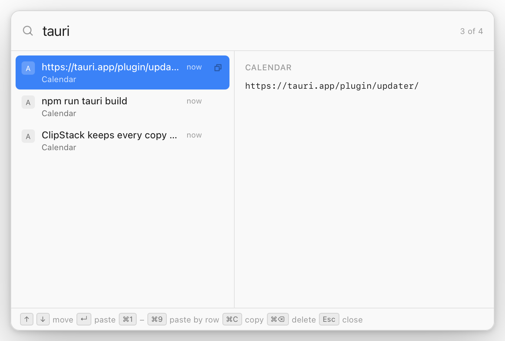
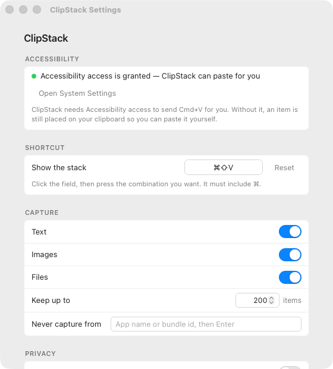

# ClipStack

A menu-bar clipboard history for macOS. Copy things the normal way and they
stack up; press the picker shortcut to search the stack and paste any earlier
entry into whatever app you are in.

It runs entirely in the menu bar — no Dock icon, no window until you ask for
one.

Press **⌘⇧V** anywhere, search, hit **↵** — the entry is pasted into the app
you were just in.



Everything is configurable from a small settings window:



## How it works

ClipStack **never intercepts Cmd+C**. A plain copy stays a plain copy, and a
plain Cmd+V stays a plain native paste. A background thread polls
`NSPasteboard.general.changeCount` every 250 ms and records whatever appeared
on the pasteboard, which is the same approach Maccy and Clipy take.

When you pick an entry from the stack:

1. the payload is written back to the pasteboard (rich text, HTML, image
   flavours, or file objects, whichever it was copied as),
2. the app you were in before the picker opened is reactivated,
3. a Cmd+V keystroke is posted to that app's process.

| What you copy | What is stacked | What is pasted |
| --- | --- | --- |
| Text | plain text + HTML + RTF when present | the same flavours, so formatting survives |
| Image | PNG, GIF (bytes kept, animation intact), or TIFF converted to PNG | `public.png` + `public.tiff` |
| Files | the file URLs | real file objects, not their paths |

Entries are deduplicated by SHA-256: copying the same thing again promotes the
existing entry to the top instead of adding a second copy. Image bytes are
stored on disk under `~/Library/Application Support/com.fradone.clipstack/blobs/`
keyed by their hash; everything else lives in a SQLite database next to it.

## Shortcuts

| Keys | What happens |
| --- | --- |
| Cmd+C | copy, as always. ClipStack just notices |
| Cmd+V | paste the newest item, natively |
| **Cmd+Shift+V** | open the stack, search, pick what to paste |
| ↑ ↓ / ↵ | move and paste |
| Cmd+1…9 | paste the matching row directly |
| Cmd+C | copy the selected item to the clipboard without pasting |
| Cmd+P | pin an entry so it cannot be evicted |
| Cmd+Backspace | delete an entry from the stack |
| Esc | dismiss the picker |

The picker shortcut is rebindable from Settings. It must include ⌘, and if
another app already owns the combination ClipStack reports it and keeps the
previous binding rather than leaving you without one.

## Getting started

```sh
npm install
npm run tauri dev      # run from the source tree
npm run tauri build    # produce ClipStack.app in src-tauri/target/release/bundle
```

To build a release the updater can consume, sign it with the project key:

```sh
./scripts/bump_version.sh 0.3.0   # updates all five version declarations
./scripts/release.sh v0.3.0       # build + sign + GitHub release + latest.json
```

`scripts/generate_app_icon.py` and `scripts/generate_tray_icon.py` regenerate
the app and menu bar icons (then `npx tauri icon docs/app-icon.png` for the
bundle formats).

### Granting Accessibility access

Paste injection needs Accessibility, and ClipStack asks on first launch. If
the prompt did not appear, open Settings and use **Grant access** or **Open
System Settings**, then switch ClipStack on in
*System Settings → Privacy & Security → Accessibility*.

**Without it the app is still useful**: picking an entry puts the payload on
your clipboard so you can press Cmd+V yourself. The picker tells you this
instead of failing silently.

### A note on unsigned builds

This project signs ad-hoc, which is fine for personal use but means the code
signature changes on every rebuild. macOS keys Accessibility permission to that
signature, so **after a rebuild you may need to remove ClipStack from the
Accessibility list and add it again**. If paste stops working after
`npm run tauri dev`, that is why. The status row in Settings shows the real
state, so you can confirm rather than guess.

To sign with a real Developer ID certificate instead, set
`APPLE_SIGNING_IDENTITY` and the permission will survive rebuilds.

### Run at login

Settings → General → **Open at login** installs a Launch Agent. The switch
reflects what macOS actually has registered, not what was requested.

### Staying up to date

You never need to re-download and reinstall ClipStack. Settings → **Updates**
checks GitHub Releases for a newer version; when one exists, **Install &
relaunch** downloads it, verifies its minisign signature against the key baked
into the app, installs it in place, and restarts. The stack, settings, and
Accessibility grant all survive the update.

Maintainers: releases are published from GitHub Releases. A release must ship
`ClipStack.app.tar.gz` plus its `.sig` (both are produced by
`npm run tauri build` when the updater key is available) and a `latest.json`
manifest describing them. See `scripts/release.sh`.

## Troubleshooting

### "could not verify “ClipStack” is free of malware that may harm your Mac or compromise your privacy"

macOS Gatekeeper blocks apps that are not notarised, which includes every
build of ClipStack since it is distributed ad-hoc-signed from GitHub Releases.
The app is safe — you are building or downloading it from this repository —
but Gatekeeper cannot verify that, so it refuses the first launch. To open it
anyway:

1. Open the app normally (the error appears) and click **Cancel / Annulla**.
2. Open **System Settings**.
3. Go to **Privacy & Security** and scroll down to the **Security** section.
4. You will see a note that ClipStack was blocked. Click **Open Anyway**.
5. Enter your Mac password or use Touch ID to confirm.

The app launches and the block is remembered, so this is a one-time step per
downloaded build. (The equivalent from a terminal is
`xattr -dr com.apple.quarantine /Applications/ClipStack.app`, but the System
Settings route above is the intended one.)

### Paste stops working after a rebuild

See [A note on unsigned builds](#a-note-on-unsigned-builds) — the ad-hoc
signature changes on every rebuild and macOS keys Accessibility to it. Remove
ClipStack from the Accessibility list, add it again.

### The picker does not appear

Check the menu bar icon: if capture is paused the picker still opens, but if
the shortcut was taken by another app ClipStack reports it in Settings →
Shortcut and keeps the previous binding. Rebind from there if needed.

## Settings

| Setting | Default | Notes |
| --- | --- | --- |
| Show the stack | Cmd+Shift+V | rebinding takes effect immediately |
| Keep up to | 200 items | lowering this trims the stack at once |
| Capture | text, images, files | each type can be turned off |
| Never capture from | none | app name or bundle id; use it for password managers |
| Pause capture | off | also in the menu bar menu |
| Keep out of screenshots | on | sets `NSWindowSharingNone` on the picker |
| Remember the stack after quitting | on | turn off to wipe the stack on quit |
| Open at login | off | Launch Agent |
| Updates | GitHub Releases | check, verify, install & relaunch in place |

Concealed pasteboard content is never recorded: anything advertising
`org.nspasteboard.ConcealedType`, `TransientType`, or `AutoGeneratedType` is
skipped, which is how password managers and apps marking content as transient
keep their copies out of the stack.

## Layout

```
src/                 two webviews, plain TypeScript
  picker.ts          the Spotlight-style panel
  settings.ts        the settings form
  lib/ipc.ts         typed wrappers over the Rust commands
  styles/            one stylesheet per window
src-tauri/src/
  lib.rs             wiring: plugins, state, window and exit events
  commands.rs        the invoke surface
  poller.rs          the changeCount watcher
  store.rs           SQLite stack, dedupe, trimming, search
  picker.rs          panel lifecycle and the paste sequence
  windows.rs         settings window and Dock-icon promotion
  tray.rs            menu bar icon and menu
  shortcuts.rs       shortcut registration with rollback
  config.rs          settings.json
  types.rs           the shared data model
  macos/             pasteboard, paste injection, frontmost app,
                     accessibility, NSWindow panel configuration
```

## Requirements

macOS only. The paste-injection and pasteboard layers are AppKit and Core
Graphics, and there is no other platform where "paste into the app the user was
just in" means the same thing.

Built with Tauri 2, `objc2` for AppKit, and `rusqlite` (bundled SQLite).

## Known limits

- Paste injection posts a keystroke to a process. Apps that block synthetic
  events, or that are fullscreen on another Space, can swallow it. The payload
  is still on your clipboard in those cases.
- Copying the same item twice within one poll interval looks like a single copy.
- Very large images are stacked but not previewed in the picker; the preview is
  skipped above 4 MB rather than base64-ing a huge blob into the webview.
- The stack is not encrypted at rest. Use *Never capture from* for anything you
  would not want on disk, and turn off *Remember the stack after quitting* if
  you want it gone on quit.
